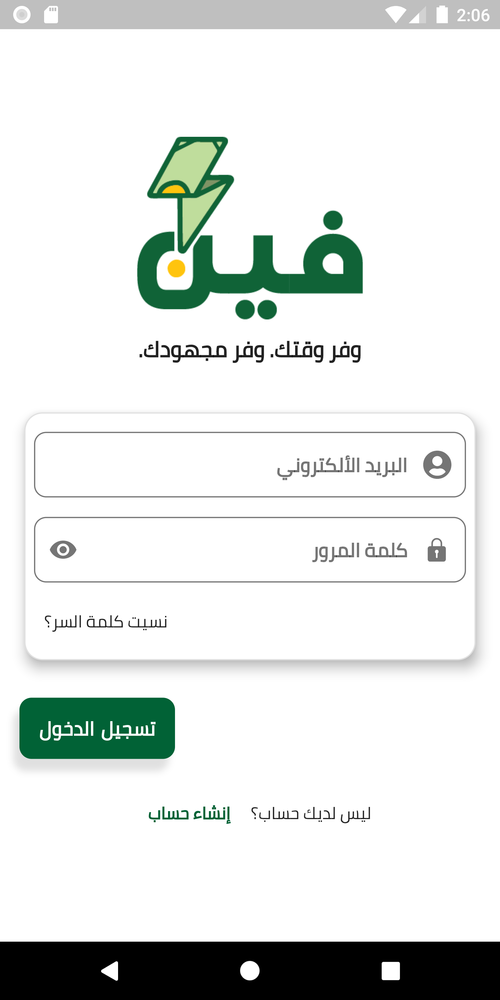
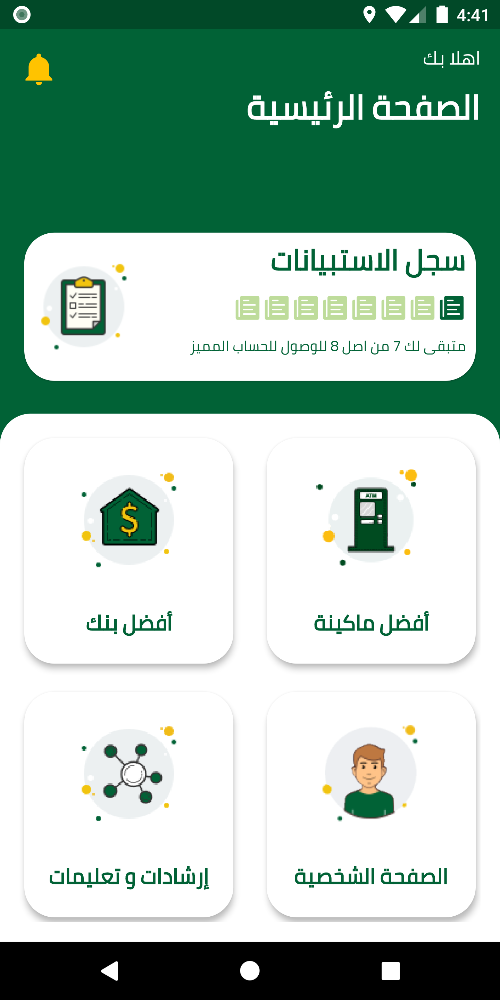
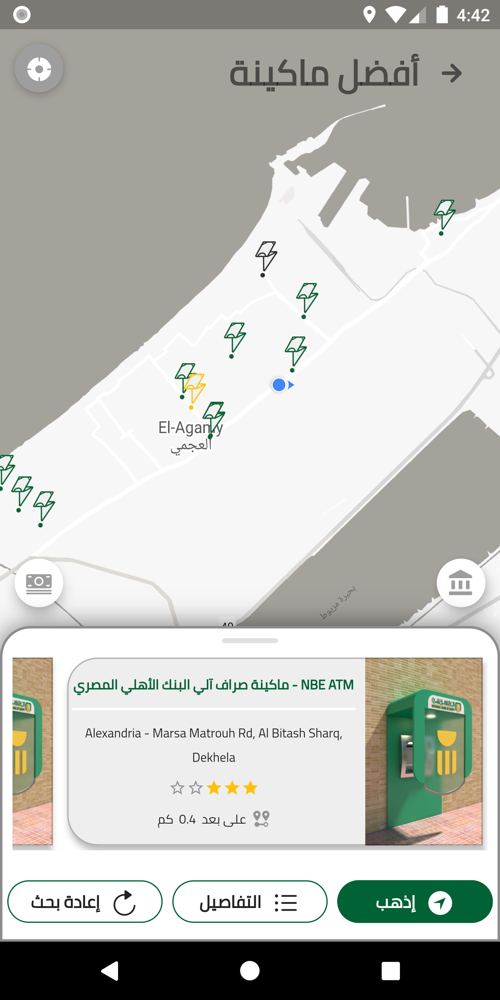
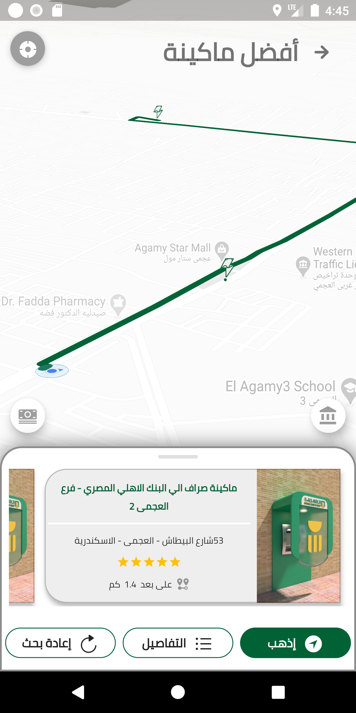
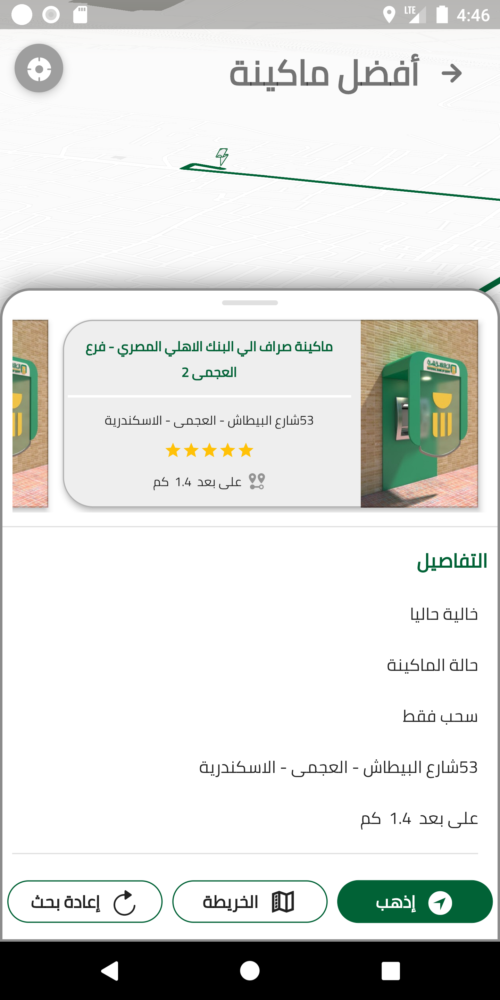
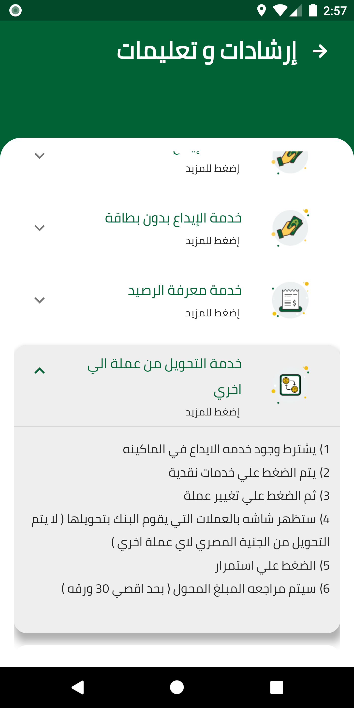
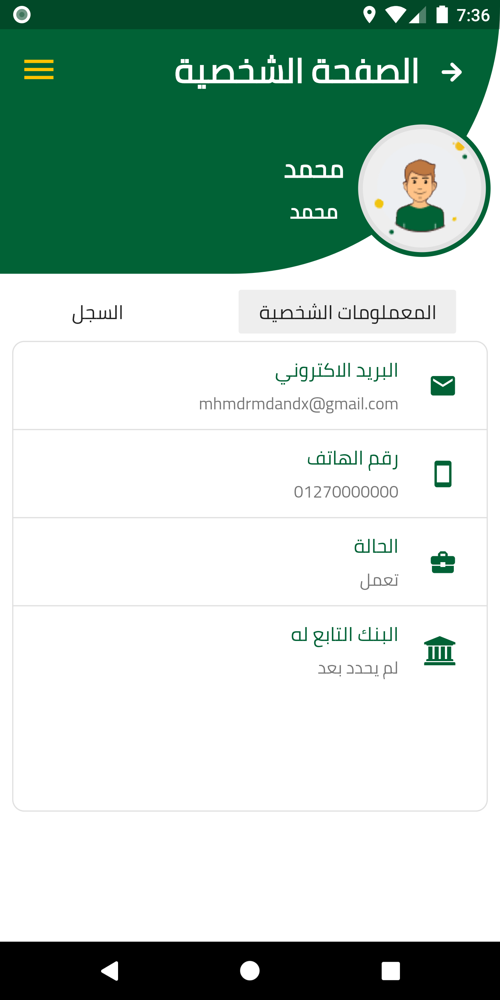
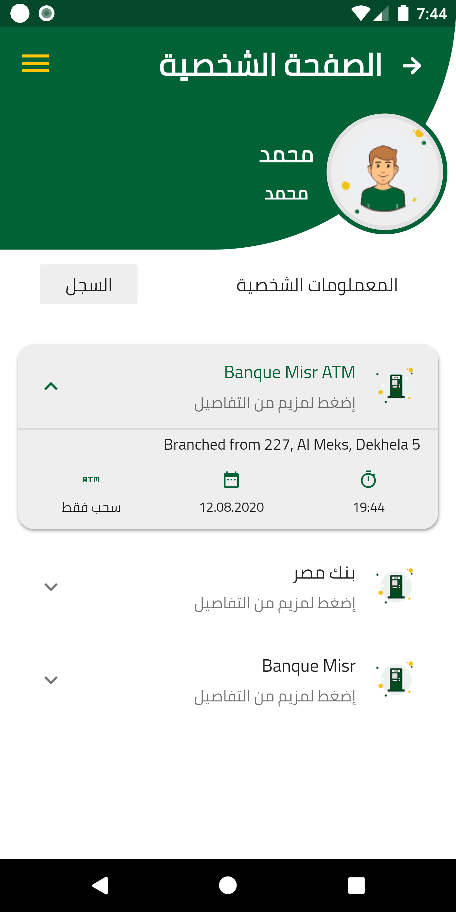

# Feen

When it comes to using ATM machines on a daily basis, we found some flaws in the process that should be quick and easy: the ATMs are crowded, under repair or haven't been reloaded yet. In addition to those, sometimes people don't even know the location of the nearest ATMs or how to get there.
We tried to solve those problems by using our application by providing services that assist you to find the best functioning ATM to your location with its current condition and even tell you how to get there by showing the route to it. Also our application has a guide to show people how to use the ATMs with their transactions for even a better experience.
We'll also show you the current status of the machine whether it's working or not, if it is being repaired. We'll also show you whether the machine has the requested amount or not. Generally, it will help you to find the best ATM for the best and quickest experience. 
Our application will help all kinds of people with the government digital transaction decision, especially in times of holidays and salary appointments and in saving the bank client time and effort, and it will be more helpful with the huge pandemic such as covid-19 that we are in.
We have plans for future updates which include notifying users when their salary is freed also assist our services to drivers.

### Built With

* [Flutter] - Framwork
* [Dart] - Programming language
* [Firebase] -  Backend as a Service
* [Google cloud] -  Platform as a Service
* [pub.dev] - Platform for external libiraries

### Authors

* [Muhammad Ramadan](https://www.linkedin.com/in/m7mdramadandx/)
* [Roa'a Gamal](https://www.linkedin.com/in/roaagamal10/)
* [Abd AlRahman Osama](https://github.com/abdelrahman-osama793)

### Sample from app

    

    

    
